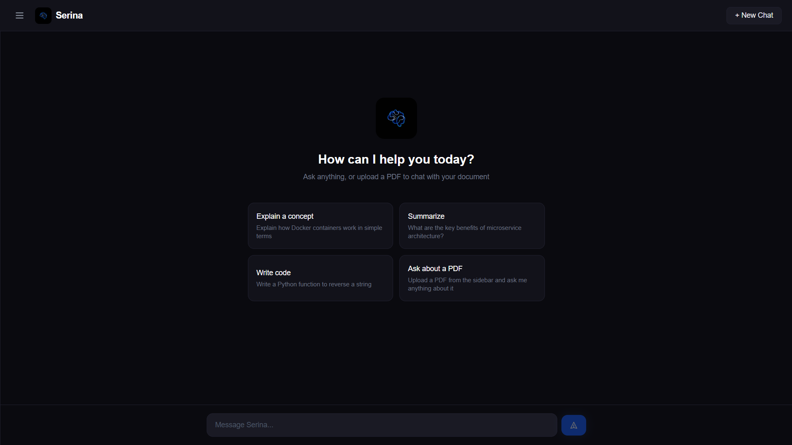
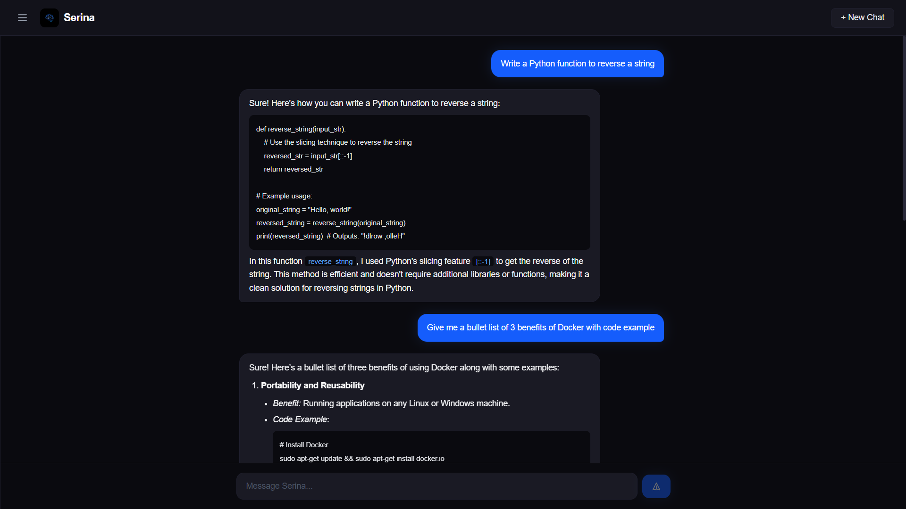
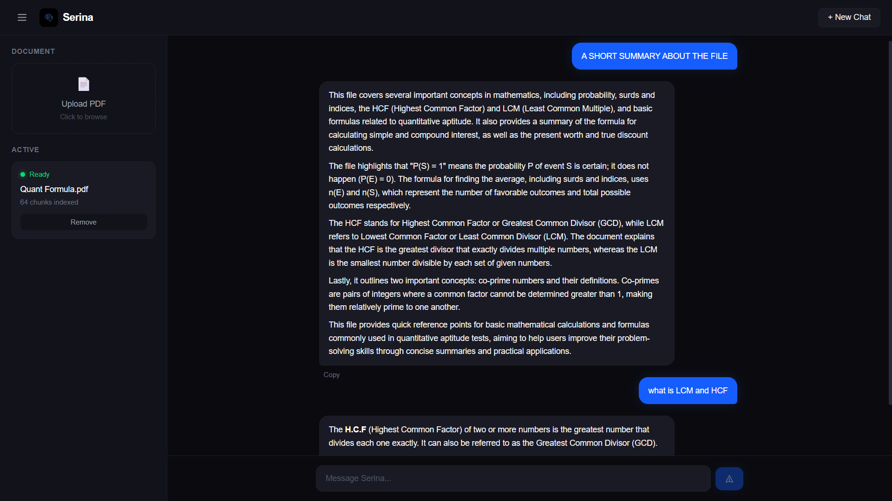

Markdown

# Serina

**A private, microservice-based AI assistant that chats naturally and answers questions from your PDFs — running fully on your own machine.**

Serina is built as a set of independently containerized services orchestrated with Docker Compose, combining a local language model, semantic search, and a modern chat interface. No API keys, no cloud, no data leaving your device.

---

## Highlights

- **Microservice architecture** — six independently deployable services communicating over an isolated Docker network
- **Fully local inference** — powered by Ollama, no external API calls
- **Retrieval-Augmented Generation** — grounded answers from your own documents with page-level references
- **Streaming responses** — real-time, word-by-word output like modern AI assistants
- **Model-agnostic** — swap the language model by changing a single configuration value
- **Production-style setup** — Nginx reverse proxy, isolated services, containerized end-to-end
- **Clean, modern UI** — dark theme, markdown rendering, suggested prompts

---

## Tech Stack

| Layer | Technology |
|---|---|
| Frontend | React, Vite, Tailwind CSS |
| Reverse proxy | Nginx |
| Backend API | FastAPI |
| Local inference | Ollama |
| Vector search | Qdrant |
| Session cache | Redis |
| Orchestration | Docker Compose |

---

## Architecture

A microservice-based system where each component runs in its own container and communicates over a private network. Nginx acts as the single public entry point.
text

                Browser
                   │
                   ▼
                Nginx  ──►  Frontend Service   (React)
                   │
                   ▼
            Backend API  ──►  Inference Service   (Ollama)
                   │      ──►  Vector Service      (Qdrant)
                   └─────►  Session Service     (Redis)
text

Six containers. One network. One entry point.

Each service is independently replaceable — the inference engine, vector database, or session store can be swapped without touching the rest of the system.

---

## How It Works

**Chat mode** — Serina keeps conversation history in a fast in-memory session store and streams responses from the local language model.

**Document mode** — An uploaded PDF is processed into searchable pieces and stored as vector embeddings. When you ask a question, the most relevant pieces are retrieved and passed as context, producing answers grounded in your document rather than the model's general knowledge.

---

## Quick Start

**Requirements:** Docker, Docker Compose, 8 GB RAM (16 GB recommended).

``bash
docker-compose ps
curl http://localhost/api/health

git clone https://github.com/kuldeepyadav001/serina.git
cd serina

cp .env.example .env

docker-compose up -d ollama qdrant redis

docker exec docuchat-ollama ollama pull qwen2.5:1.5b
docker exec docuchat-ollama ollama pull nomic-embed-text

docker-compose up -d --build
Open http://localhost

Verify:
Bash
docker-compose ps
curl http://localhost/api/health

Model Swapping
The language model is configuration-driven, not hardcoded. Change one value in .env and restart:
Bash
CHAT_MODEL=qwen2.5:1.5b   # lightweight
CHAT_MODEL=qwen2.5:7b     # higher quality, needs more RAM
The same configuration point allows swapping to any Ollama-compatible model without modifying application code.

Screenshots
Serina start screen

Conversation

Answering from a PDF

Roadmap
Shipped

Streaming chat with session memory
PDF ingestion and document Q&A
Full microservice deployment with Docker Compose
Configuration-driven model selection
Planned

Multi-document support with switching
Persistent conversation history
Additional file formats and OCR for scanned documents
In-app model selection
Support for cloud inference providers behind the same abstraction
Authentication and cloud deployment
Kubernetes orchestration

Author
Kuldeep Yadav — @kuldeepyadav001

